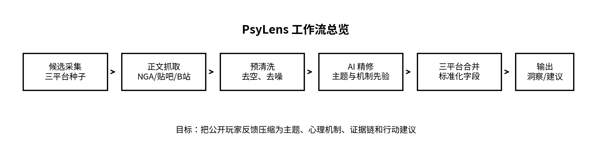
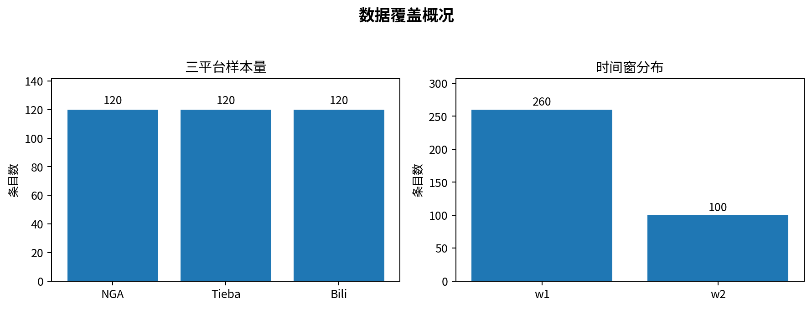
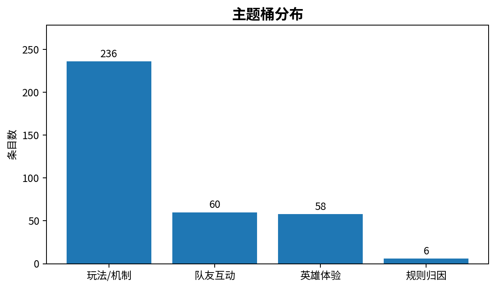
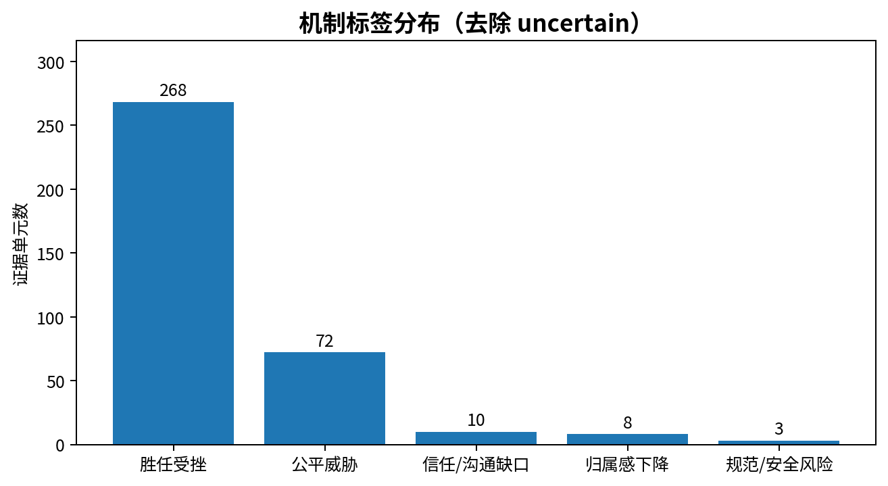

# PsyLens

## 多平台游戏社区反馈洞察工作流

以《英雄联盟》海克斯大乱斗模式为例，整合 NGA、贴吧、B站公开社群反馈，完成候选筛选、正文抓取、预清洗、AI 精修、主题归类、机制编码、证据校验与行动建议生成。

---

## 项目摘要

PsyLens 是一个围绕公开游戏社区反馈搭建的研究与数据工作流案例。项目聚焦《英雄联盟》海克斯大乱斗模式，目标不是简单统计玩家是否“在抱怨不公平”，而是进一步判断：高频争议究竟更稳定地指向哪类体验问题与心理机制。

在当前版本中，项目形成了三平台整洁版样本共 360 条，其中 NGA、贴吧、B站各 120 条；样本同时保留近期窗口与历史对照窗口。结果显示，海克斯大乱斗中的高频争议更稳定地指向**胜任受挫**，公平威胁是重要但次级的补充机制。

---

## 研究问题

### 1. 近期公开讨论中，最集中的争议主题是什么？
重点观察玩法/机制、队友互动、英雄体验与规则归因四类主题。

### 2. 这些争议更稳定地与哪类心理机制共现？
重点比较胜任受挫、公平威胁及其他补充机制。

### 3. 不同平台语境下，主机制是否一致？
比较 NGA、贴吧、B站三平台在表达方式上的差异，以及在结论上的一致性。

### 4. 如果从产品与社区视角回应，这些问题可以转化成哪些建议？
将结构化结果压缩为可用于沟通和决策讨论的建议矩阵。

---

## 执行流程

项目流程分为六个环节：

1. 三平台候选采集  
2. 正文抓取与整理  
3. 预清洗（去空、去噪）  
4. AI 精修（主题与机制先验）  
5. 三平台合并与字段标准化  
6. 输出 validated insights 与 action matrix

---

## 数据概览

三平台整洁版样本共 360 条：

- NGA：120
- 贴吧：120
- B站：120

时间窗分布：

- w1：260
- w2：100

---

## 主题与机制结果

### 主题桶分布

### 机制标签分布

从三平台整洁版结果看，样本中占比最高的是“玩法/机制”相关讨论，其次是“队友互动”和“英雄体验”。在机制层面，胜任受挫的证据单元显著多于公平威胁，说明玩家更常表达的是玩法理解成本高、努力与结果不匹配、操作感被削弱等体验，而不是单纯抽象地指向“系统不公平”。

---

## 核心结论

### 主结论
海克斯大乱斗的高频争议更稳定地指向**胜任受挫**。

### 次级结论
公平威胁主要集中在匹配与奖励等特定场景中，是重要但次级的补充机制。

### 平台补充
- NGA：玩法/机制争议信号最强
- 贴吧：补充队友互动与历史窗口表达
- B站：补充视频语境下的英雄体验与队友互动讨论

---

## 文件入口

### 项目说明文件
- [企业投递版项目说明（DOCX）](files/PsyLens_enterprise_project_brief_v3.docx)

### 核心结果文件
- [三平台整洁版输入](files/input_feedback_phase2_multiplatform_clean.csv)
- [证据表](files/final_evidence_table.csv)
- [验证洞察](files/04_validated_insights.jsonl)
- [行动建议矩阵](files/05_action_matrix.json)

---

## 关键脚本说明

公开仓库中保留了部分关键脚本，用于说明项目的主要流程链：

- `run_pipeline.py`
- `merge_phase2_inputs.py`
- `preclean_feedback_registry.py`
- `ai_curate_feedback.py`
- `crawl_tieba_selected.py`
- `crawl_bili_selected_auto.py`

这些脚本用于展示项目在“抓取—清洗—合并—编码—输出”上的基本实现路径。

---

## 项目边界

本项目基于公开社区反馈，属于探索性专题案例，不直接外推为整个平台总体玩家的普遍性结论。自动筛选和 AI 精修提升了执行效率，但最终口径依然经过人工复核与压缩。

---

## 联系方式

如需进一步了解项目方法、执行过程或案例细节，可通过 GitHub 仓库主页联系作者。
